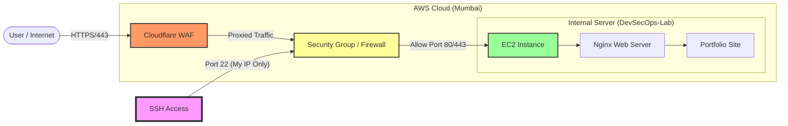

# 🛡️ Secure Cloud Infrastructure Deployment (AWS)

## ✈️ The "Aeronautical" Approach to Cloud Security
> *"In aviation, safety isn't an option; it's the baseline. I apply the same zero-error tolerance from Aeronautical Engineering to Cloud Infrastructure."*

This project demonstrates a **secure-by-design** web server deployment on AWS. Unlike typical "Hello World" setups, this infrastructure adheres to **NIST SP 800-53** principles regarding Access Control (AC) and System Integrity (SI).

---

## 🏗️ Architecture Design
The system uses a **Defense-in-Depth** strategy, ensuring that even if one layer fails, the core asset remains protected.

## 🔒 Security Controls Implemented
1. Perimeter Defense (Network Security)
Least Privilege Firewalling: The AWS Security Group is configured to deny all non-essential traffic.
SSH Hardening: SSH (Port 22) is restricted strictly to a Single Static IP (/32 CIDR). This renders Brute Force attacks mathematically impossible from the open internet.
Reverse Proxy: (Planned) Cloudflare acts as the edge defense, masking the origin server's true IP.

2. System Integrity
Service Redundancy: Nginx is configured as a systemd service with auto-restart enabled, ensuring High Availability (HA) in case of process failure.
Minimalist OS: Deployed on Ubuntu Server (CLI only) to reduce the attack surface (no GUI vulnerabilities).

3. Compliance & Auditing
Audit Trails: Configured /var/log/auth.log monitoring to detect unauthorized sudo attempts.
User Accountability: Root login is disabled; all administrative tasks are performed via sudo with specific user attribution.

🛠️ Technical Stack
Cloud Provider: Amazon Web Services (AWS) EC2
OS: Ubuntu 24.04 LTS
Web Server: Nginx (Reverse Proxy Mode)
Tools: Bash, SSH, Systemd

🚀 How to Deploy (Reproduction Steps)

1. Launch Instance
# Update repositories to ensure patch compliance
sudo apt update && sudo apt upgrade -y

2. Install Web Server
sudo apt install nginx -y
sudo systemctl enable nginx

3. Secure the Firewall (AWS CLI Example)
# Example logic for restricting SSH
aws ec2 authorize-security-group-ingress \
    --group-id sg-12345 \
    --protocol tcp \
    --port 22 \
    --cidr 106.51.x.x/32

👨‍💻 About Me
Tharun Pranav RS | Aeronautical Engineer | CompTIA Security+ Certified

Transitioning from Aeronautical Engineering to Cybersecurity, I build cloud systems with the same rigor used in flight safety protocols.
   
